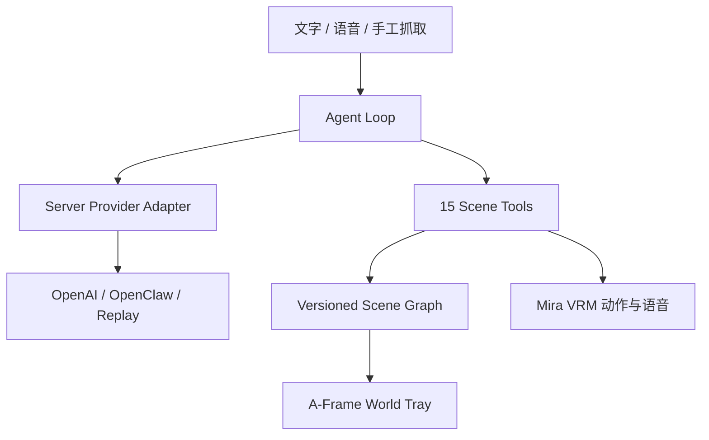

# Architecture

Pocket World Agent 保留 Incarna 的 A-Frame + three-vrm 路线，把多 Agent 办公室收敛为单角色空间共创体验。前端永远只执行已注册的结构化工具，模型不能返回 JavaScript、HTML 或任意代码。

## Boundaries

- 浏览器：渲染、输入、Scene Graph、Tool Validation、Undo 和 LocalStorage Save/Load。
- 服务端：读取密钥、调用中性的 LLM/STT/TTS Provider；LLM 返回严格的 `say + emotion + avatarAction + commands`，语音密钥和音频供应商细节不进入前端。
- Catalog：Agent 只能使用 `ASSET_MANIFEST.json` 中存在的 `assetId`。
- Replay：没有密钥或 Provider 出错时使用确定性计划，比赛现场仍可完整演示。

## Scene Graph

Scene Graph 当前版本为 `1`，包含稳定的 `sceneId`、Tray transform 和物件数组。每个物件使用稳定 `instanceId`，并保存 `assetId/position/rotation/scale/color/locked`。所有工具变更和手工变换都经过 `SceneStore`，因此渲染层不是状态源。

## Safety budgets

- 单轮最多 14 个命令；
- Repair 最多 2 次；
- 场景最多 40 个对象；
- 托盘坐标：x ±0.9、y 0–0.65、z ±0.6；
- 缩放每轴 0.05–2；
- 非法命令返回稳定错误，不执行部分危险状态；
- Tool Timeline 只保存工具事件和可展示摘要，不保存隐藏推理。
